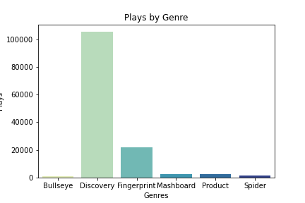
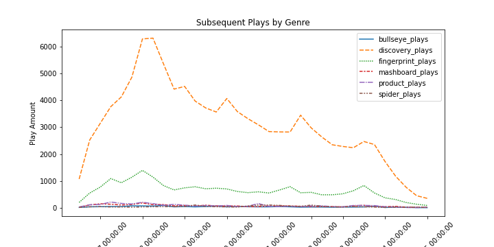

# R4 Data Exercise

Author: Chaz Frazer<br>

# Overview
Data Science interview process for r4 technologies utilizing fake player ID and game genre data. This data looks at both initial and subsequent playthroughs.<br>

The focus of the exercise is to look at the shift of player engagement across genres on a daily and weekly basis using timeseries and comparative EDA.<br><br>


# Data
#### Data Columns:
1. ID (user ID)
2. First_Play_Date (date user first used service)
3. Play_Date (date of play/stream)
4. Genre (genre of portal being played)<br>

#### Game Genres:
1. Bullseye
2. Discovery
3. Fingerprint
4. Mashboard
5. Product
6. Spider<br><br>


# Business Quesitons
#### Question A:
What are some of the first things you notice about this data set? What is in it?<br>

- Rows contain user IDs containing the first initial play date, as well as each subsequent client access of the service. We can see that there are 2798 unique user IDs using the service.
- 6 unique genres of:
    - Bullseye (1183 appearances, 435 unique IDs)
    - Discovery (105489 appearences, 2519 unique IDs)
    - Fingerprint (21802 appearences, 1959 unique IDs)	
    - Mashboard (2339 appearences, 592 unique IDs)
    - Product (2711 appearences, 451 unique IDs)
    - Spider (1426 appearences,	609 unique IDs)
- User ID (WMT-eb43dc75-8c60-487c-9615-4e750042a0e3-26930-7f412b5358c1bbab7a1b8356f2794c7ee30fc26) has the highest number of games, having played Discovery 1077 times.<br>

#### Question B:
Using this data, please answer the question-  does genre usage shift week-to-week (relative to when a user first used the service)?  For example, are users more likely to play Fingerprint during week one of their subscription, but then Mashboard during week 2 and 3?<br>

- Users are most likely to start off with Discovery, then in week 2 move on to Fingerprint in leading up to and during week 2. After week 2, Discovery plays drop off sharply, while Fingerprint playthroughs taper off slightly. Other game genres mostly hold steady throughout the subsequent weeks.<br>

#### Question C:
How would you improve the service by improving customer engagement?<br>

- Provide incentives for playthoughs of each genre, specific to the game. For example: create leaderboards, viewable stat data of their closest peers, discord servers for game genres where a community can grow; including developer interaction, and in-game challenges that reap trophies or awards specific to gameplay tasks.
- Run A/B testing on the above implementations subsetting a control group of players who have access to the aforementioned gameplay incentives, and those who do not.
- Run timeseries models using Arima, Sarimax, etc. to view the predictive weekly engagement of the following weeks past the border data of 2/9/2015. Analyze ROC curve compared to other game modes.
<br><br>


# EDA & Visualizations
1. Plays by Genre
<br>
Discovery has by far the most initial playthroughs. This is exacerbated by its continual play rate in the subsequent weeks, solidifying its popularity over the other game modes. Fingerprint comes in a distant second but is still in its own tier as compared to the other 4 game modes.<br>

2. Subsequent Plays by Genre
<br>
Discovery plays increase steadily for the first 2 1/2 weeks, then tapers off steadily while experiencing some seasonality. Players are likely to move on and dabble in Fingerprint, but the rate of change is more static compared to Discovery.<br>

3. Weekly Plays by Genre
<br>
Weekly view of the play data smoothes out the seasonality of the data, but at the same time enhances the view of dominance that Discovery has over the other game genres. Examination of the intricacies of the other genres could provide some insight into why user engagement with them is so low.<br><br>


# Next Steps
1. Explore other game genres and differences to pinpoint why one genre has such dominance over the other five.
2. Implement the analysis and modeling outlined in Question C.
3. Work with longer/larger data to view more user engagement across months or years.<br><br>


# Repository Structure
```
├── data
├── img
├── .gitignore
├── R4 Data Science Exercise.ipynb   
└── README.md


